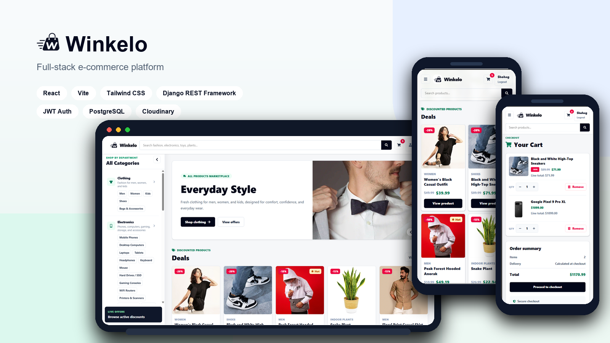
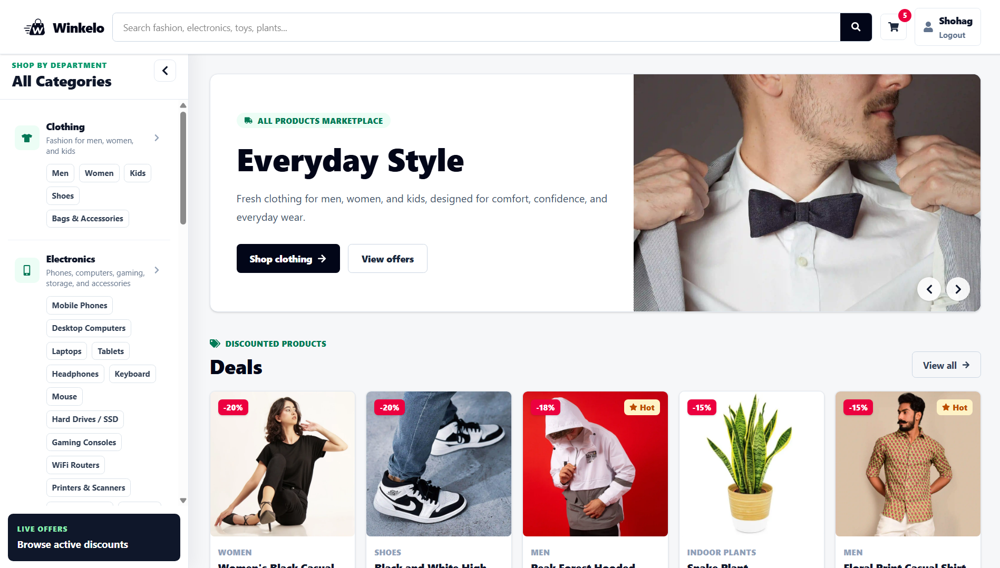
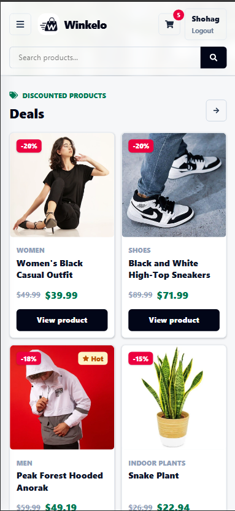
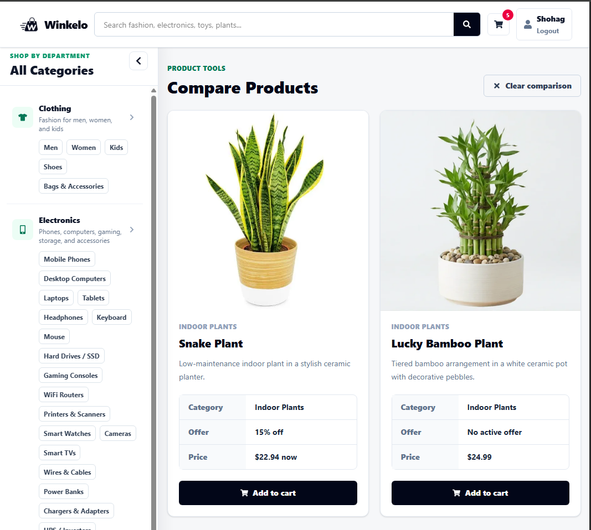
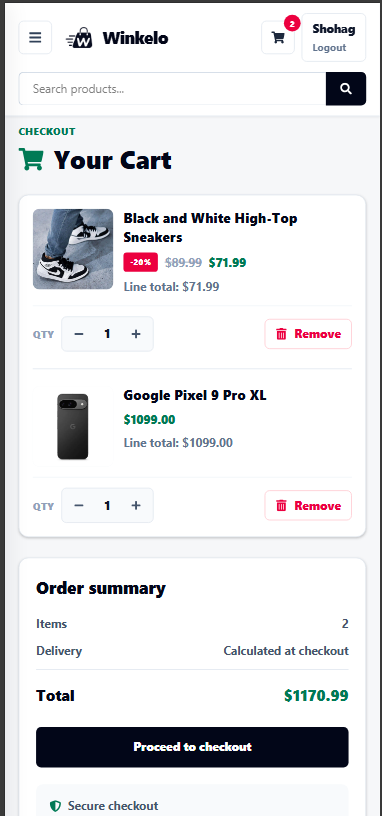
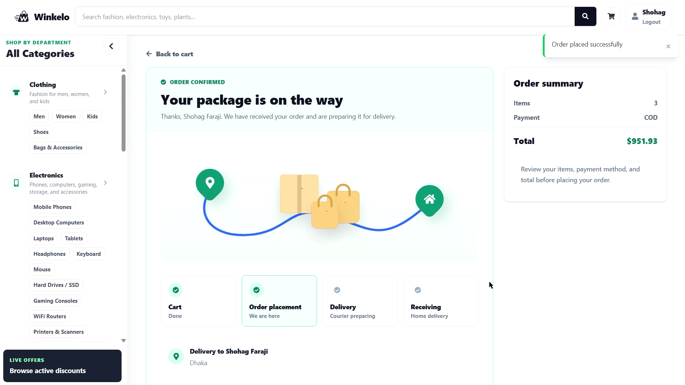
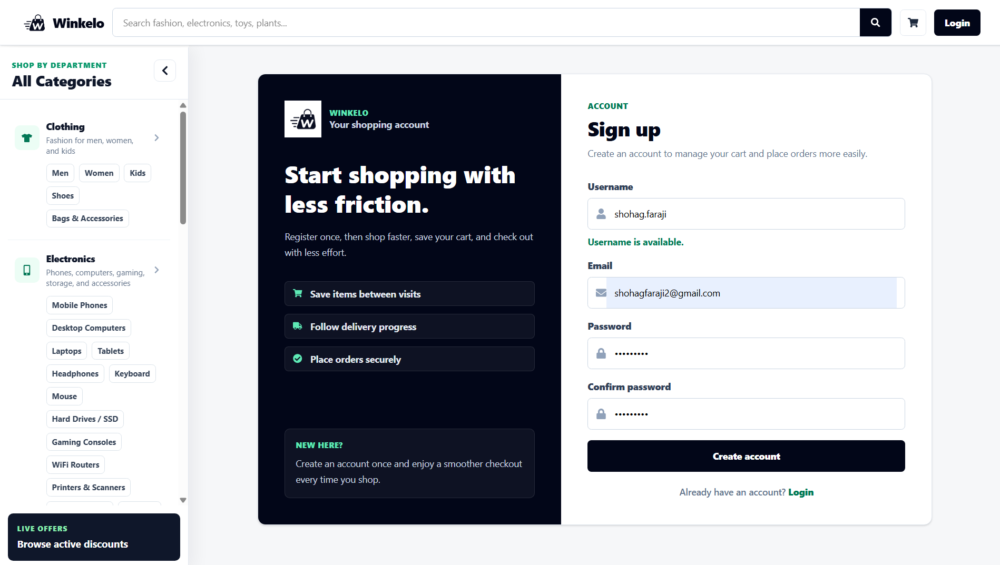

# Winkelo - E-Commerce Platform

&nbsp;&nbsp;<a href="https://winkelo.netlify.app"></a>&nbsp;&nbsp;&nbsp;&nbsp;&nbsp;&nbsp;

Winkelo is an e-commerce application built with a React frontend and a Django REST Framework backend. It covers the core storefront flow end to end: product discovery, account authentication, cart management, checkout, admin-managed merchandising, image delivery, and cloud deployment.

The project is intentionally split into a decoupled frontend and backend. React handles the customer experience, routing, responsive UI, and client-side performance details. Django REST Framework owns product data, authentication, cart persistence, order creation, caching, and media URL handling.

[](https://winkelo.netlify.app)&nbsp;&nbsp;[](https://react-django-ecommerce-3cfu.onrender.com)



> The live deployment uses free-tier cloud services. If the backend or database is inactive, the first request may take longer than usual while the service wakes up.

---

## Table of Contents

- [At a Glance](#at-a-glance)
- [Screenshots](#screenshots)
- [Project Highlights](#project-highlights)
- [Tech Stack](#tech-stack)
- [Architecture](#architecture)
- [Core Features](#core-features)
- [API Overview](#api-overview)
- [Local Development](#local-development)
- [Scripts](#scripts)
- [Environment Variables](#environment-variables)
- [What This Project Demonstrates](#what-this-project-demonstrates)
- [Roadmap](#roadmap)
- [License](#license)

---

## At a Glance

- **Frontend:**     

- **Backend:**    

- **Media:**  Cloudinary-hosted product, category, and banner images

- **Deployment:**   

- **Authentication:** JWT access/refresh tokens with protected checkout

- **Commerce flow:** Browse products, compare items, manage cart, and place orders

---

## Screenshots

| Home Page                                                  | Mobile Home                                              |
| ---------------------------------------------------------- | -------------------------------------------------------- |
|  |  |

| Product Compare                                                | Cart                                                |
| -------------------------------------------------------------- | --------------------------------------------------- |
|  |  |

| Checkout                                                   | Authentication                                           |
| ---------------------------------------------------------- | -------------------------------------------------------- |
|  |  |

---

## Project Highlights

- **Decoupled full-stack architecture:** React communicates with Django exclusively through REST APIs.
- **JWT authentication:** Users can register, log in, refresh access tokens, and access protected checkout routes.
- **Dynamic product catalog:** Supports category filtering, section filtering, keyword search, new arrivals, sale products, and weekly top sellers.
- **Admin-managed storefront content:** Categories, hero banners, featured products, hot products, weekly top sellers, and discounts are controlled from the backend.
- **Homepage aggregation endpoint:** A single API response powers banners, deals, hot products, and category sections to reduce frontend request overhead.
- **Persistent cart:** Authenticated users can add, update, and remove cart items with immediate UI feedback.
- **Transaction-safe checkout:** Order creation is wrapped in a database transaction, so the cart is cleared only after the order is successfully created.
- **Optimized image delivery:** Cloudinary URLs are resolved and optimized server-side before being rendered by the frontend.
- **Frontend performance details:** Client-side API caching, image preloading, skeleton states, and responsive navigation improve perceived speed.
- **Deployment-ready configuration:** Environment-based settings, PostgreSQL support, CORS configuration, WhiteNoise, Gunicorn, and Render startup files are included.

---

## Tech Stack

### Frontend

<table>
<tr><th>Technology</th><th>Purpose</th></tr>
<tr><td valign="middle"></td><td valign="top"><span style="display:inline-block; margin-top:-10px;">Component-based UI</span></td></tr>
<tr><td valign="middle"></td><td valign="top"><span style="display:inline-block; margin-top:-10px;">Frontend development server and production build</span></td></tr>
<tr><td valign="middle"></td><td valign="top"><span style="display:inline-block; margin-top:-10px;">Client-side routing</span></td></tr>
<tr><td valign="middle"></td><td valign="top"><span style="display:inline-block; margin-top:-10px;">Utility-first styling</span></td></tr>
<tr><td valign="middle"></td><td valign="top"><span style="display:inline-block; margin-top:-10px;">Icon system</span></td></tr>
</table>

### Backend

<table>
<tr><th>Technology</th><th>Purpose</th></tr>
<tr><td valign="middle"></td><td valign="top"><span style="display:inline-block; margin-top:-10px;">Backend application framework</span></td></tr>
<tr><td valign="middle"></td><td valign="top"><span style="display:inline-block; margin-top:-10px;">REST API layer</span></td></tr>
<tr><td valign="middle"></td><td valign="top"><span style="display:inline-block; margin-top:-10px;">Access and refresh token authentication</span></td></tr>
<tr><td valign="middle"></td><td valign="top"><span style="display:inline-block; margin-top:-10px;">Relational data storage</span></td></tr>
<tr><td valign="middle"></td><td valign="top"><span style="display:inline-block; margin-top:-10px;">Cross-origin frontend/backend communication</span></td></tr>
<tr><td valign="middle"></td><td valign="top"><span style="display:inline-block; margin-top:-10px;">Static file serving</span></td></tr>
<tr><td valign="middle"></td><td valign="top"><span style="display:inline-block; margin-top:-10px;">Media storage and delivery</span></td></tr>
</table>

### Deployment

<table>
<tr><th>Service</th><th>Role</th></tr>
<tr><td valign="middle"></td><td valign="top"><span style="display:inline-block; margin-top:-10px;">Frontend hosting</span></td></tr>
<tr><td valign="middle"></td><td valign="top"><span style="display:inline-block; margin-top:-10px;">Backend API hosting</span></td></tr>
<tr><td valign="middle"></td><td valign="top"><span style="display:inline-block; margin-top:-10px;">Hosted PostgreSQL database</span></td></tr>
<tr><td valign="middle"></td><td valign="top"><span style="display:inline-block; margin-top:-10px;">Product and storefront media</span></td></tr>
</table>

---

## Architecture

```text
React + Vite Frontend
        |
        | REST / JSON over HTTPS
        v
Django REST Framework API
        |
        ├── PostgreSQL database
        ├── Cloudinary media storage
        └── Django cache layer
```

Backend responsibilities:

- Authenticate users with JWT.
- Serialize products, categories, carts, banners, and homepage data.
- Filter products by category tree, section, search query, and product flags.
- Resolve optimized image URLs for Cloudinary and local development media.
- Keep checkout consistent with database transactions.

Frontend responsibilities:

- Render responsive storefront pages.
- Manage client-side routing and protected routes.
- Store and refresh JWT tokens.
- Cache API responses and preload product images.
- Provide cart interactions with immediate user feedback.

---

## Core Features

### Storefront

- Product catalog with search, category filters, and section filters.
- Product details page with image, category, description, price, and discount data.
- New arrivals, sale products, and weekly top-selling product pages.
- Product comparison for up to two products.
- Responsive navbar, collapsible sidebar, footer, and loading states.

### Authentication

- User registration with duplicate username validation.
- Login with JWT access and refresh tokens.
- Access-token refresh for authenticated requests.
- Protected checkout route.

### Cart and Checkout

- Add products to cart.
- Update item quantities.
- Remove cart items.
- Persist cart per authenticated user.
- Create orders from cart items.
- Validate checkout phone number.
- Clear cart only after successful order creation.

### Admin-Managed Content

- Parent and child product categories.
- Featured categories for homepage sections.
- Hero banners with optional active date windows.
- Product flags for featured, hot, and weekly top-selling items.
- Product discount percentages for sale pricing.

---

## API Overview

Base URL:

```text
https://react-django-ecommerce-3cfu.onrender.com/api/
```

| Method | Endpoint                            | Auth | Description                                                                      |
| ------ | ----------------------------------- | ---- | -------------------------------------------------------------------------------- |
| POST   | `/api/register/`                    |    | Create a user account                                                            |
| GET    | `/api/register/check-username/`     |    | Check username availability                                                      |
| POST   | `/api/token/`                       |    | Log in and receive JWT tokens                                                    |
| POST   | `/api/token/refresh/`               |    | Refresh an access token                                                          |
| GET    | `/api/homepage/`                    |    | Fetch homepage banners, deals, hot products, and category sections               |
| GET    | `/api/products/`                    |    | List products with optional `category`, `section`, `search`, and `limit` filters |
| GET    | `/api/product/<id>/`                |    | Fetch product details                                                            |
| GET    | `/api/products/new-arrivals/`       |    | Fetch newest products                                                            |
| GET    | `/api/products/weekly-top-selling/` |    | Fetch weekly top-selling products                                                |
| GET    | `/api/products/sale/`               |    | Fetch products with discounts                                                    |
| GET    | `/api/categories/`                  |    | Fetch active category tree                                                       |
| GET    | `/api/hero-banners/`                |    | Fetch active homepage hero banners                                               |
| GET    | `/api/cart/`                        |   | Fetch the authenticated user's cart                                              |
| POST   | `/api/cart/add/`                    |   | Add a product to cart                                                            |
| POST   | `/api/cart/update/`                 |   | Update cart item quantity                                                        |
| POST   | `/api/cart/remove/`                 |   | Remove an item from cart                                                         |
| POST   | `/api/orders/create/`               |   | Create an order from the current cart                                            |

---

## Local Development

### Prerequisites

- Python 3.12+
- Node.js 20.19+ (or 22.12+)
- PostgreSQL
- Cloudinary account

### Backend Setup

```bash
cd backend
python -m venv venv
```

Activate the virtual environment:

```bash
# Windows
venv\Scripts\activate

# macOS/Linux
source venv/bin/activate
```

Install dependencies:

```bash
pip install -r requirements.txt
```

Create `backend/.env`:

```env
SECRET_KEY=your_secret_key
DEBUG=True

DB_NAME=your_database
DB_USER=your_database_user
DB_PASSWORD=your_database_password
DB_HOST=localhost
DB_PORT=5432

CLOUDINARY_CLOUD_NAME=your_cloud_name
CLOUDINARY_API_KEY=your_api_key
CLOUDINARY_API_SECRET=your_api_secret
```

Run migrations and start the backend:

```bash
python manage.py migrate
python manage.py runserver
```

Backend URL:

```text
http://127.0.0.1:8000/api/
```

### Frontend Setup

```bash
cd frontend
npm install
```

Create `frontend/.env`:

```env
VITE_DJANGO_BASE_URL=http://127.0.0.1:8000
```

Start the frontend:

```bash
npm run dev
```

Frontend URL:

```text
http://localhost:5173
```

---

## Scripts

### Frontend

```bash
npm run dev
npm run build
npm run preview
npm run lint
```

### Backend

```bash
python manage.py runserver
python manage.py migrate
python manage.py createsuperuser
```

---

## Environment Variables

### Backend

| Variable                   | Description                           |
| -------------------------- | ------------------------------------- |
| `SECRET_KEY`               | Django secret key                     |
| `DEBUG`                    | Enables or disables Django debug mode |
| `DATABASE_URL`             | Production database connection URL    |
| `DB_NAME`                  | Local PostgreSQL database name        |
| `DB_USER`                  | Local PostgreSQL user                 |
| `DB_PASSWORD`              | Local PostgreSQL password             |
| `DB_HOST`                  | Local PostgreSQL host                 |
| `DB_PORT`                  | Local PostgreSQL port                 |
| `CLOUDINARY_CLOUD_NAME`    | Cloudinary cloud name                 |
| `CLOUDINARY_API_KEY`       | Cloudinary API key                    |
| `CLOUDINARY_API_SECRET`    | Cloudinary API secret                 |
| `RENDER_EXTERNAL_HOSTNAME` | Render-provided backend hostname      |

### Frontend

| Variable               | Description                     |
| ---------------------- | ------------------------------- |
| `VITE_DJANGO_BASE_URL` | Base URL for the Django backend |

---

## What This Project Demonstrates

- Building and deploying a complete full-stack application.
- Designing REST APIs for real storefront workflows.
- Handling token-based authentication and protected API access.
- Modeling products, categories, carts, orders, banners, and promotional content.
- Using database transactions for checkout consistency.
- Improving frontend experience with caching, preloading, and responsive layouts.
- Managing environment-specific settings for local and cloud deployments.

---

## Roadmap

- Add automated backend test coverage for cart, checkout, and authentication flows.
- Add React component and integration tests.
- Add paginated product browsing through Django REST Framework pagination.
- Add wishlist and order history pages.
- Add product reviews and ratings.
- Add customer profile management.
- Add admin analytics for sales and product performance.
- Add transactional email confirmation after checkout.

---

## License

This project was built for portfolio and learning purposes.
