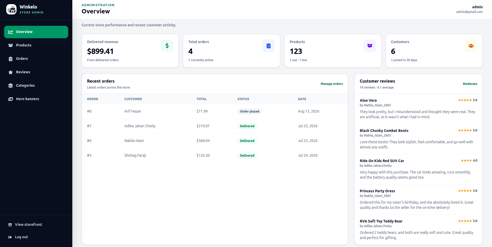
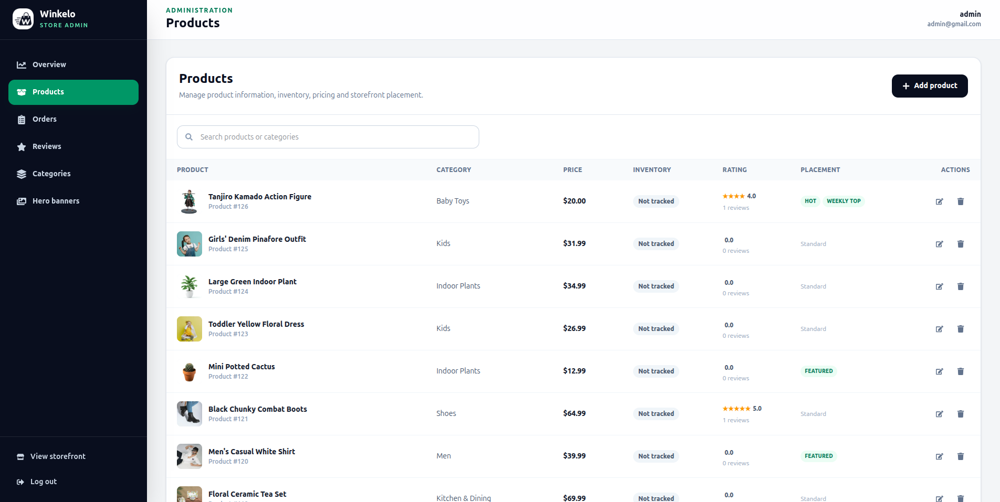
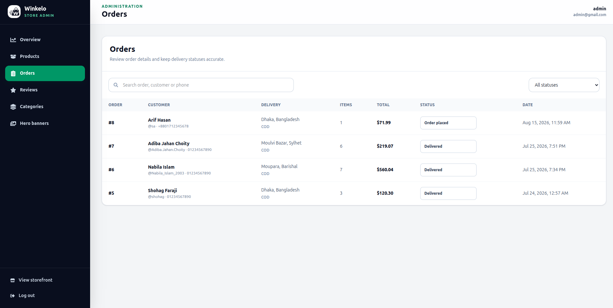

# Winkelo

Winkelo is an e-commerce project built with React and Django REST Framework.

- Live site: https://winkelo.netlify.app
- Backend: https://react-django-ecommerce-3cfu.onrender.com


The backend may take a short time to respond after being inactive because the live version uses free hosting.

## Features

- Product search and category filtering
- New arrival, sale, and weekly top-selling pages
- Product comparison
- JWT login and registration
- User profile and profile-picture upload
- Cart and checkout
- Order history and delivery status
- Product ratings and reviews
- Review comments and image attachments
- Review editing and deletion
- Reviews limited to customers with delivered products
- Staff-only admin dashboard for products, categories, banners, orders, inventory, and reviews
- Cloudinary image storage

## Admin dashboard

Winkelo includes a custom React administration dashboard at `/admin`. Access is restricted to authenticated Django staff users, and every admin API endpoint is protected on the server with Django REST Framework's `IsAdminUser` permission.

### Admin interface



| Product and inventory management | Order management |
| --- | --- |
|  |  |

### Dashboard overview

- Product, category, customer, order, and review totals
- Pending and delivered order summaries
- Revenue calculated from delivered orders
- Low-stock and out-of-stock product counts
- New-customer count for the previous 30 days
- Recent orders, recent reviews, and order-status breakdowns

### Catalog management

- Create, search, edit, and delete products
- Manage product images, prices, discounts, category assignments, and storefront flags
- Enable inventory tracking and maintain stock quantities and low-stock thresholds
- Create and organize parent and child categories
- Control category visibility, featured placement, images, descriptions, and display order

### Order and review management

- Filter orders by status and search by customer or order details
- Update order progress from placement through delivery or cancellation
- Restore reserved stock when an eligible order is cancelled
- Search and inspect customer reviews, ratings, comments, and attachments
- Remove inappropriate reviews and their associated images

### Storefront content

- Create, edit, order, activate, and remove homepage hero banners
- Configure banner text, images, linked categories, visibility, and scheduling dates
- Automatically invalidate relevant storefront caches after catalog or banner changes

## Screenshots

| Desktop home | Mobile home |
| --- | --- |
|  |  |

| Product comparison | Mobile cart |
| --- | --- |
|  |  |

| Checkout | Sign up |
| --- | --- |
|  |  |

## Technology

### Frontend

- React 19
- React Router
- Vite
- Tailwind CSS
- React Icons

### Backend

- Django
- Django REST Framework
- Simple JWT
- PostgreSQL
- Cloudinary
- WhiteNoise

### Hosting

- Netlify for the frontend
- Render for the backend
- Supabase PostgreSQL database

## Project structure

```text
backend/
  backend/       Django settings and main URLs
  store/         Models, serializers, views, admin, migrations, and tests

frontend/
  public/        Public images and icons
  src/
    components/  Shared React components
    context/     Cart and alert contexts
    pages/       Application pages
    utils/       Authentication, caching, and order helpers
```

## Local setup

### Requirements

- Python 3.12 or newer
- Node.js 20.19 or newer
- PostgreSQL
- Cloudinary account if Cloudinary uploads are enabled

### Backend

```bash
cd backend
python -m venv venv
```

Activate the virtual environment.

Windows:

```bash
venv\Scripts\activate
```

Linux or macOS:

```bash
source venv/bin/activate
```

Install the packages:

```bash
pip install -r requirements.txt
```

Create `backend/.env`:

```env
SECRET_KEY=your_secret_key
DEBUG=True

DB_NAME=your_database
DB_USER=your_database_user
DB_PASSWORD=your_database_password
DB_HOST=localhost
DB_PORT=5432

CLOUDINARY_CLOUD_NAME=your_cloud_name
CLOUDINARY_API_KEY=your_api_key
CLOUDINARY_API_SECRET=your_api_secret
USE_CLOUDINARY_MEDIA=False
```

Run the backend:

```bash
python manage.py migrate
python manage.py runserver
```

### Frontend

```bash
cd frontend
npm install
```

Create `frontend/.env`:

```env
VITE_DJANGO_BASE_URL=http://127.0.0.1:8000
```

Run the frontend:

```bash
npm run dev
```

Open http://localhost:5173.

## Main API routes

| Method | Route | Access |
| --- | --- | --- |
| POST | `/api/register/` | Public |
| POST | `/api/token/` | Public |
| POST | `/api/token/refresh/` | Public |
| GET | `/api/homepage/` | Public |
| GET | `/api/products/` | Public |
| GET | `/api/product/<id>/` | Public |
| GET | `/api/products/<id>/reviews/` | Public |
| GET | `/api/categories/` | Public |
| GET | `/api/cart/` | Required |
| POST | `/api/cart/add/` | Required |
| POST | `/api/cart/update/` | Required |
| POST | `/api/cart/remove/` | Required |
| POST | `/api/orders/create/` | Required |
| GET | `/api/orders/` | Required |
| GET | `/api/orders/<id>/` | Required |
| POST | `/api/reviews/` | Required |
| PATCH | `/api/reviews/<id>/` | Required |
| DELETE | `/api/reviews/<id>/` | Required |
| GET | `/api/profile/` | Required |
| PATCH | `/api/profile/` | Required |

### Admin API routes

All routes below require an authenticated staff account.

| Method | Route | Purpose |
| --- | --- | --- |
| GET | `/api/admin/dashboard/` | Dashboard metrics and recent activity |
| GET, POST | `/api/admin/products/` | List, search, or create products |
| PATCH, DELETE | `/api/admin/products/<id>/` | Update or delete a product |
| GET | `/api/admin/orders/` | List, search, or filter orders |
| PATCH | `/api/admin/orders/<id>/status/` | Update an order's delivery status |
| GET, POST | `/api/admin/categories/` | List or create categories |
| PATCH, DELETE | `/api/admin/categories/<id>/` | Update or delete a category |
| GET | `/api/admin/reviews/` | List, search, or filter reviews |
| DELETE | `/api/admin/reviews/<id>/` | Delete a review |
| GET, POST | `/api/admin/banners/` | List or create hero banners |
| PATCH, DELETE | `/api/admin/banners/<id>/` | Update or delete a hero banner |

## Tests

Backend:

```bash
cd backend
python manage.py test store
```

Frontend:

```bash
cd frontend
npm run lint
npm run build
```

## Deployment variables

The backend deployment uses these additional variables:

- `DATABASE_URL`
- `DIRECT_URL`
- `RENDER_EXTERNAL_HOSTNAME`
- `USE_CLOUDINARY_MEDIA`

`DIRECT_URL` is used by the Render build script when running migrations.

## License

This project was built for learning and portfolio use.
